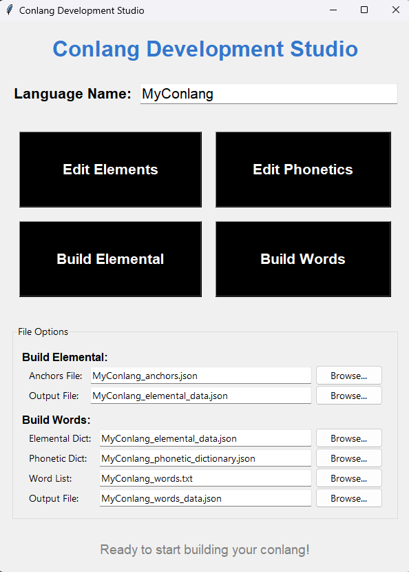
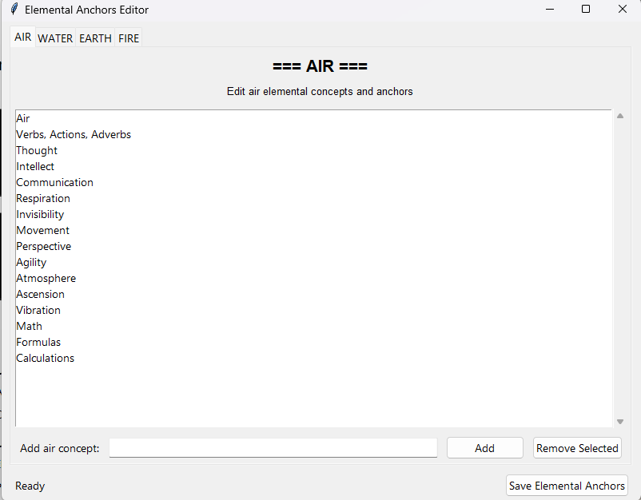
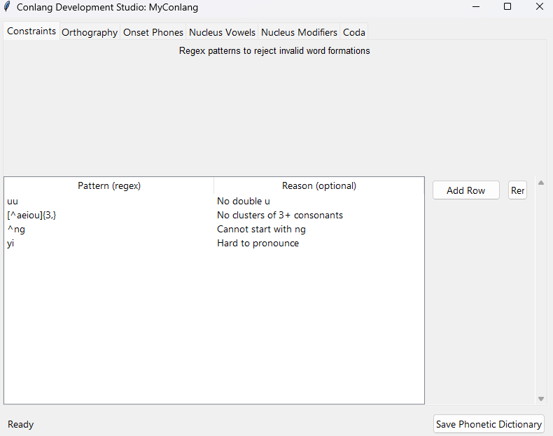

Check out it's superior, far more flexible, predecessor,  (Globlocks)[https://github.com/tripstych/glotblocks]


# Elemental Conlang Project

A comprehensive constructed language toolkit that analyzes words through elemental associations and generates translation dictionaries.

## Installation

### Dependencies

Install all required packages:

```bash
pip install -r requirements.txt
```

### NLTK Data Setup

After installing dependencies, download required NLTK data:

```bash
python -c "import nltk; nltk.download('punkt'); nltk.download('wordnet'); nltk.download('averaged_perceptron_tagger'); nltk.download('omw-1.4')"
```

### spaCy Model

Download the English language model:

```bash
python -m spacy download en_core_web_lg
```

## Quick Start

### 1. Build Elemental Dictionary

Your first step if you're starting without any .json files for data:

```bash
python build_elemental_dictionary.py
```

This is the core semantic categorization engine, currently configured to quantize 'elemental' aspects of words (e.g., "creative" has a high fire quotient).

### 2. Generate Translation Dictionary

Next, run the logo gene script:

```bash
python logo_gene.py
```

This creates your translation dictionary `elemental_dict.json`.

### 3. Launch GUI (Optional)

You can also run `main.py` for a GUI to access any of the project's data files:

```bash
python main.py
```

## Available Scripts

### Core Processing
- `build_elemental_dictionary.py` - Main semantic categorization engine
- `build_base5.py` - Alternative Wu Xing (5 elements) categorization
- `bed.py` - Simplified elemental analysis

### Translation & Analysis
- `babel.py` - English to conlang translator
- `logo_gene.py` - Generates translation dictionaries
- `logo_asian_gene.py` - Asian language variant
- `chemigram.py` - Finds elemental anagrams
- `zipfs.py` - Word frequency analysis

### GUI Tools
- `edit_phonetic.py` - Phonetic dictionary editor
- `edit_elementals.py` - Elemental anchors editor
- `main.py` - Main GUI launcher

### Utilities
- `words_cleaner.py` - Text cleaning utilities
- `yoda.py` - Yoda-speak transformer
- `toke.py` - Tokenization utilities
- `report.py` - Generate analysis reports

## Usage Examples

### Interactive Translation
```bash
python babel.py --mode interactive
```

### Batch Translation
```bash
python babel.py --mode auto --convo conversation.txt --output translation.txt
```

### Yoda Mode
```bash
python babel.py --mode interactive --yoda
```

## File Structure

- `conlang_lexicon.json` - Main translation lexicon
- `elemental_dict.json` - Elemental word associations
- `phonetic_dictionary.json` - Phonetic mappings
- `words.txt` - Source word list for processing

## GUI Applications

Launch the main GUI:
```bash
python main.py
```

### Screenshots

**Main Application Interface**


**Elements Editor**


**Phonetic Rules Editor**


Or run specific editors:
```bash
python edit_phonetic.py      # Edit phonetic dictionary
python edit_elementals.py    # Edit elemental anchors
```
